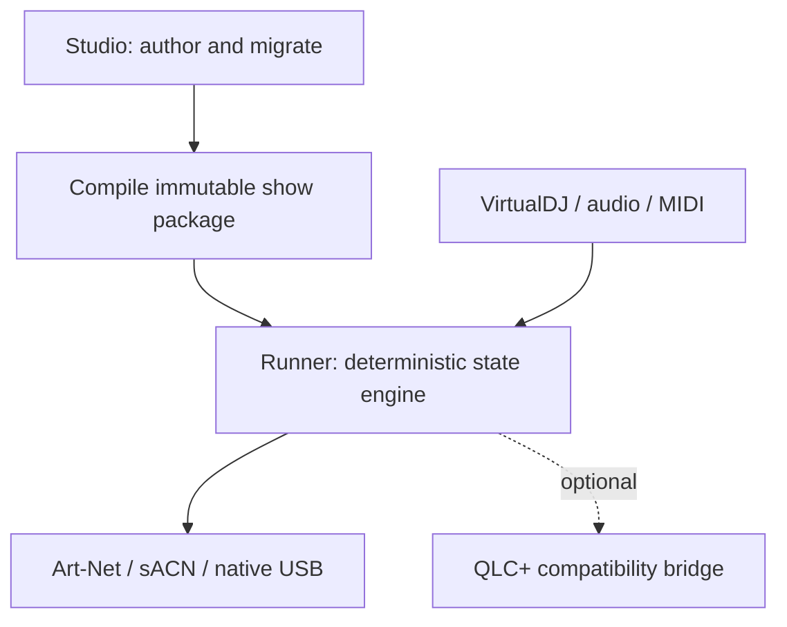
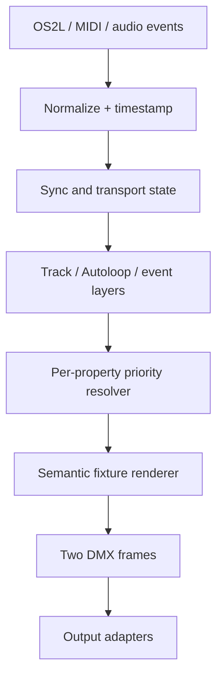
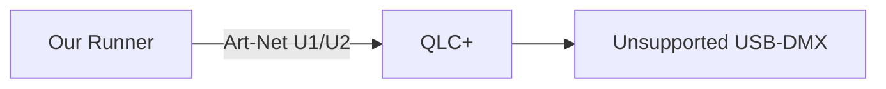

# Architecture

## Architectural thesis

Authoring can be sophisticated; performance must be small and deterministic.

## Operational components

### Studio

Runs only while preparing content. It may include library indexing, audio decoding, waveforms, beatgrid/phrase analysis, AutoScripting, fixture import, venue construction, timeline editing, migration, controller mapping, preview, and compilation.

### Runner

Loads one validated immutable show package and contains only:

- normalized DJ/controller/audio adapters;
- synchronization manager;
- track/Autoloop/event state;
- sparse layer resolver;
- semantic fixture renderer;
- two-universe frame scheduler;
- output adapters;
- controller feedback;
- minimal performance UI, diagnostics, and recovery.

Runner does not scan the music library, parse the full fixture library, render waveforms, run AI, or host an embedded browser.

### Optional workers

- Audio analysis starts only when needed or when configured for readiness.
- An unstable/proprietary USB adapter may run in an isolated broker.
- QLC+ may run as a compatibility bridge, receiving localhost/LAN Art-Net and driving an adapter for which we lack a native driver.

### Windows MIDI adapter boundary

The first Windows adapter uses WinMM only behind the device-agnostic MIDI contract. Each opened input port owns a bounded callback-to-adapter queue so multiple controllers do not turn one queue into an unsafe multi-producer path. WinMM system indices are discovery-time identifiers; persisted mappings use our logical device identity and later reconnect matching rather than assuming an index is stable.

Short-message output for LEDs/rings runs on the controller-feedback adapter thread, never the DMX scheduler. Microsoft notes that `midiOutShortMsg` may block until hardware sends the message, so Runner treats feedback as bounded, optional, and lower priority than lighting output. [Microsoft `midiInOpen`](https://learn.microsoft.com/en-us/windows/win32/api/mmeapi/nf-mmeapi-midiinopen), [Microsoft `midiOutShortMsg`](https://learn.microsoft.com/en-us/windows/win32/api/mmeapi/nf-mmeapi-midioutshortmsg)

### Native USB-DMX boundary

The first native adapter implements ENTTEC's published DMX USB Pro application framing over a Windows COM port. A configured device owns one universe; two devices may independently carry V1's two universes. Serial discovery, open/retry, packet writes, and zero-frame shutdown all run on the output thread, never the scheduler. The scheduler publishes into a bounded SPSC queue, and the output consumer deliberately takes the newest available frame so a temporarily blocked interface cannot replay stale lighting after recovery.

The SoundSwitch Micro adapter is a separate WinUSB implementation for the verified `VID_15E4/PID_0053` interface and bulk OUT pipe `0x01`. It sends the independently established JLS1 initialization sequence once per open, then a complete 522-byte native frame for the selected project universe. It shares the output thread, newest-frame-wins queue, reconnect, and zero-frame shutdown rules. Diagnostics treats device-open state, accepted writes, Windows failures, and nonzero rendered-slot evidence as distinct facts.

The adapter is a replaceable output contract, not a fixture or show-model dependency. It does not imply qualification of the legacy two-universe Pro Mk2 protocol or every third-party device that advertises protocol compatibility. [ENTTEC DMX USB Pro API](https://support.enttec.com/dmx/usbdmx-dmx-usb-pro-70304/dmx-usb-pro-api)

### Output-backend capability and health contract

Every configured output now publishes the same allocation-free health snapshot: backend kind, project-universe range, lifecycle state, open attempts/successes, reconnects, attempted/accepted/failed frames, last platform error, and last nonzero-slot count. The output thread owns state changes; Diagnostics and qualification reports consume atomic snapshots. This keeps UI, soak tests, packaging evidence, and future adapters from inferring health from device-specific strings.

Backend descriptors separately record implementation stage, evidence stage, capabilities, advertised hardware universe count, EmberLights-supported universe count, and whether direct configuration is allowed. Host-accepted writes, loopback delivery, physical DMX response, and gig qualification remain distinct evidence levels.

- SoundSwitch Micro, DMX USB Pro, Art-Net, and sACN use the implemented contract today.
- SoundSwitch Control One's standard MIDI surface remains independent from its two DMX outputs. The isolated Windows JLC1/JLS1 transport now verifies `VID_15E4/PID_0054`, configuration 1, interface 0, bulk OUT `0x01`, sends the four established startup controls, and routes complete 522-byte frames to zero-based ports 0 and 1. It has the shared safe-close and health contract but cannot appear as a selectable direct output until the installed two-jack/blackout/replug procedure is physically verified.
- WOLFmix is treated as a standalone lighting engine. Its documented DMX-input capability may become a bounded hardware bridge after owned-device verification, but its USB service is not represented as an EmberLights USB-DMX adapter.

Adding either device later therefore changes an adapter/broker or bridge implementation and qualification matrix, not fixtures, show packages, rendering, scheduling, project semantics, or safety rules.

## Fixture-library ingestion boundary

Open Fixture Library is an upstream source, not a Runner file format. [OFL's format documentation](https://github.com/OpenLightingProject/open-fixture-library/blob/master/docs/fixture-format.md) explicitly warns that its native JSON may make breaking changes and recommends transforming it through a plugin. Studio therefore uses version-pinned adapters to translate upstream data into our stable native fixture-profile contract, recording the source, adapter version, and source identity.

The first implemented ecosystem adapter accepts QLC+ Fixture Definition (`.qxf`) XML, including files emitted by OFL's QLC+ export plugin. It is an original bounded parser used only by Studio: input size, XML nodes, nesting, attributes, and reports are capped; external entities and DTD subsets are rejected; source hashes and creator metadata are recorded. QXF modes become independent native profiles. Coarse/fine pairs, channel defaults, regular strobe ranges, emitter colors, and known semantic presets are converted; switching aliases are quarantined, and flattened multi-head topology is reported for manual verification. Imported profiles are validated by the same native compiler as locally authored profiles.

Profiles that cannot be represented safely are quarantined with exact reasons; one malformed or unsupported profile cannot block the rest of the library or a compiled show. Only validated profiles used by the active show enter Runner's immutable package. Runner performs no QXF/OFL parsing, network fetch, or fixture-library scan during a gig.

## Runtime dataflow

## Layer model

Lowest to highest priority:

1. Idle look.
2. Default autonomous show.
3. Track-specific script.
4. Manually selected Autoloop.
5. Event-moment look.
6. Manual fixture/parameter override.
7. Emergency state.
8. Safety policy/restriction.

Every fixture property at every layer has three states:

- `RELEASE` — consult the next lower layer;
- `SET(value)` — own the property with a semantic value;
- `FORCE_ZERO` — explicitly drive the property off/zero.

Safety is also enforced after resolution: fog/spark/laser require explicit arming; strobe can be prohibited or capped; movement/intensity can be capped for photographer or venue modes.

## Semantic fixture model

Scripts address roles/capabilities such as `dance_floor_wash.color`, `movers.position = couple`, or `uplights.intensity = 0.65`. Venue/fixture profiles translate these into 8/16-bit DMX values, discrete ranges, and device-specific behavior.

Stable fixture identity is separate from universe/address so replacement or repatching does not delete cues.

## Synchronization hierarchy

1. Exact DJ transport data.
2. Short predictive hold using the last trustworthy clock.
3. Live-audio BPM/phase detection.
4. Manual BPM/tap tempo.
5. Safe unsynchronized fallback look.

OS2L loss is a state machine, not a Boolean. Exact song scripting pauses when track identity/playhead are no longer trustworthy; beat-synchronized autonomous content continues.

## Same-PC and separate-PC equivalence

Every input/output adapter uses an explicit endpoint configuration. Loopback is only a default. A show package and controller mapping behave identically whether VirtualDJ and Runner share a machine or communicate over a private wired LAN.

Security rule: do not expose unauthenticated control endpoints beyond the trusted event network. Remote administration requires a separate authenticated design.

## Autoloop library and control surfaces

Runner compiles Autoloops into a fixed-capacity library of 64 banks with 32 slots per bank. This 2,048-loop ceiling is a deterministic V1 package limit, not a SoundSwitch-derived product constraint. A controller with four physical bank selectors receives a pageable four-bank window over the library; Studio, Runner UI, MIDI mappings, and larger controllers may address any bank directly. Controller layout never defines show-package capacity.

## QLC+ hybrid boundary

The QLC+ bridge is a frame-output adapter, not a state authority:

QLC+ never owns our fixtures, scripts, Autoloops, MIDI semantics, timing, or project file. If it disappears, a native/network adapter can replace it without changing show content.

## Persistence

Studio source data is versioned and human-inspectable. Studio compiles it into a checksummed immutable show package containing only used fixture capabilities, patch, groups, palettes, effects, scripts, mappings, safety policy, and recovery state.

Package activation is atomic. Runner keeps the last known-good package and can reject/quarantine corrupt assets without losing output.

## Technology decision status

- Production core: Rust preferred but not accepted yet.
- Native reference spike: portable C++20, dependency-light, fully compiled/tested in the current environment.
- Runner UI: undecided; must pass a representative footprint/repaint benchmark.
- Studio UI: undecided and may use a richer toolkit because it is not resident during gigs.
- Platform order: Windows production launch first; macOS later. Core contracts remain portable where practical.

The language/toolkit decision is evidence-based and must not change the domain contracts above.
