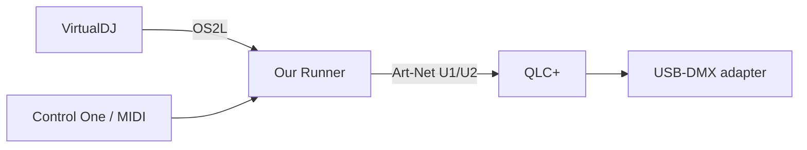

# Optional QLC+ Hardware Bridge

Status: designed and code-boundary complete; real QLC+ hardware verification pending.

## Purpose

Use QLC+ temporarily for a USB-DMX interface that it supports and our Runner does not yet support natively.

Our Runner remains authoritative for timing, layers, fixtures, Autoloops, safety, MIDI, and recovery. It sends final Universe 1/2 frames over unicast Art-Net. QLC+ receives those frames and forwards them to the selected USB output.

## Intended topology

QLC+ may run:

- on the same PC, using loopback/private interface; or
- on a separate lighting PC, using a private wired event LAN.

## Constraints

- Optional only; never required for a supported native/network adapter.
- QLC+ project contains only input/output routing needed for the bridge.
- No duplicated show programming in QLC+.
- Direct unicast destination; do not broadcast ArtDMX.
- Map one Runner universe to exactly one QLC+ input/output universe.
- Disable competing mergers/sources unless intentionally tested.
- Runner must detect/report bridge unavailability; UDP send success alone does not prove downstream output.

## Verification plan

1. Install current QLC+ on the Windows lighting test PC.
2. Verify the owned adapter works directly from a simple QLC+ scene.
3. Configure QLC+ Art-Net input and USB output for one universe.
4. Send Runner reference colors/intensity ramps and compare physical output.
5. Add Universe 2.
6. Measure Runner-only versus Runner+QLC+ RSS, CPU, frame jitter, cold start, and reconnect behavior.
7. Disconnect/reconnect USB and QLC+ while Runner continues producing state.
8. Decide whether the bridge is acceptable for gigs or lab/migration use only.

## Why not link QLC+ directly

The current QLC+ engine brings Qt Core/GUI/Multimedia and a broad general-console model. The bridge obtains its hardware reach without importing that dependency/model into the lean Runner. Selective source adaptation remains possible only where it is smaller and better than a clean native adapter.
